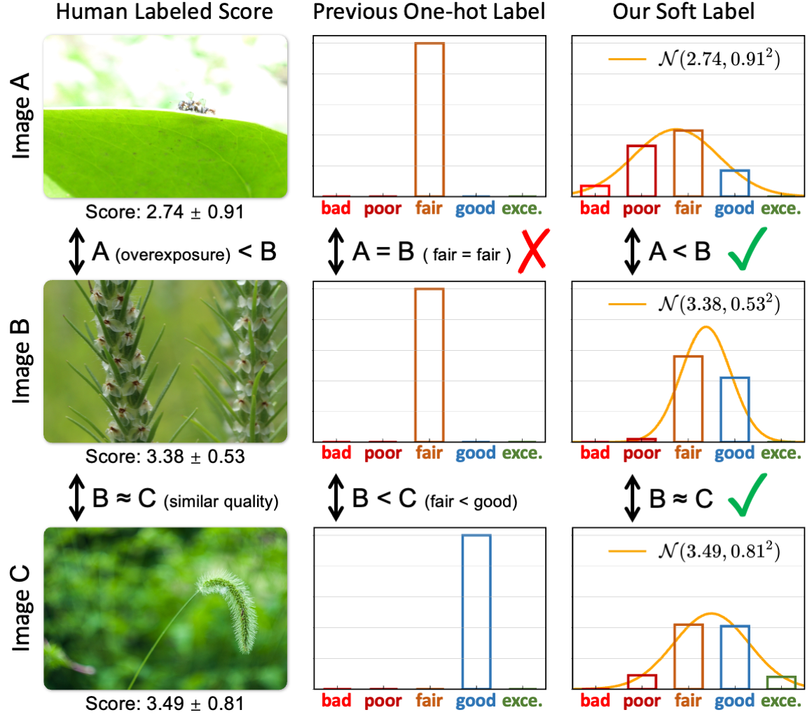
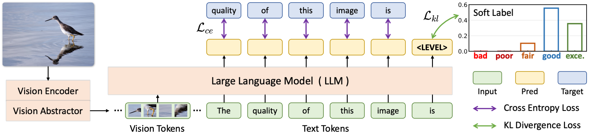

<div align="center">
  <h1>Teaching Large Language Models to Regress Accurate Image Quality Scores using Score Distribution</h1> 

<div>
    <a href="https://zhiyuanyou.github.io/" target="_blank">Zhiyuan You</a><sup>12</sup>,
    <a href="https://caixin98.github.io/" target="_blank">Xin Cai</a><sup>2</sup>,
    <a href="https://www.jasongt.com/" target="_blank">Jinjin Gu</a><sup>4</sup>,
    <a href="https://tianfan.info/" target="_blank">Tianfan Xue</a><sup>23</sup><sup>#</sup>,
    <a href="https://xpixel.group/2010/01/20/chaodong.html" target="_blank">Chao Dong</a><sup>134</sup><sup>#</sup>
</div>

<div>
  <sup>1</sup>Shenzhen Institutes of Advanced Technology, Chinese Academy of Sciences, <sup>2</sup>The Chinese University of Hong Kong, 
  <sup>3</sup>Shanghai AI Laboratory, <sup>4</sup>Shenzhen University of Advanced Technology  
</div>

<div><sup>#</sup>Corresponding author.</div>

<div>
  <a href="https://depictqa.github.io/deqa-score/" target="_blank"><strong>Homepage</strong></a> | 
  <strong>Model Weights</strong> ( 
  <a href="https://huggingface.co/zhiyuanyou/DeQA-Score-Mix3" target="_blank"><strong>Full Tuning</strong></a> / 
  <a href="https://huggingface.co/zhiyuanyou/DeQA-Score-LoRA-Mix3" target="_blank"><strong>LoRA Tuning</strong></a> 
  ) | 
  <a href="https://huggingface.co/datasets/zhiyuanyou/Data-DeQA-Score" target="_blank"><strong>Datasets</strong></a> | 
  <a href="https://arxiv.org/abs/2501.11561" target="_blank"><strong>Paper</strong></a> 
</div>

<h2>Motivation</h2> 

<div style="width: 100%; text-align: center; margin:auto;">
      
</div>

<h2>Model Architecture</h2> 

<div style="width: 100%; text-align: center; margin:auto;">
      
</div>
</div>


## [Installation Free!] Quicker Start with Hugging Face AutoModel

Only with `transformers==4.36.1`. No need to install this GitHub repo

```python
import requests
import torch
from transformers import AutoModelForCausalLM

model = AutoModelForCausalLM.from_pretrained(
  "zhiyuanyou/DeQA-Score-Mix3",
  trust_remote_code=True,
  attn_implementation="eager",
  torch_dtype=torch.float16,
  device_map="auto",
)

from PIL import Image

# The inputs should be a list of multiple PIL images
model.score(
  [Image.open(requests.get(
    "https://raw.githubusercontent.com/zhiyuanyou/DeQA-Score/main/fig/singapore_flyer.jpg", stream=True
    ).raw)]
)
```


## Installation

If you only need to infer / evaluate:

```shell
git clone https://github.com/zhiyuanyou/DeQA-Score.git
cd DeQA-Score
pip install -e .
```

For training, you need to further install additional dependencies as follows:

```shell
pip install -e ".[train]"
pip install flash_attn --no-build-isolation
```


## Quick Start


### Image Quality Scorer

- CLI Interface

```shell
python src/evaluate/scorer.py --img_path fig/singapore_flyer.jpg
```

- Python API

```python
from src import Scorer
from PIL import Image

scorer = Scorer()
img_list = [Image.open("fig/singapore_flyer.jpg")] # can be a list of multiple PIL images
print(scorer(img_list).tolist())
```


## Training, Inference & Evaluation

### Datasets

<a id="datasets"></a>

- Download our meta files from [Huggingface Metas](https://huggingface.co/datasets/zhiyuanyou/Data-DeQA-Score). 

- Download source images from [KonIQ](https://database.mmsp-kn.de/koniq-10k-database.html), 
[SPAQ](https://github.com/h4nwei/SPAQ), 
[KADID](https://database.mmsp-kn.de/kadid-10k-database.html), 
[PIPAL](https://github.com/HaomingCai/PIPAL-dataset), 
[LIVE-Wild](https://live.ece.utexas.edu/research/ChallengeDB/index.html), 
[AGIQA](https://github.com/lcysyzxdxc/AGIQA-3k-Database), 
[TID2013](https://www.ponomarenko.info/tid2013.htm), 
and [CSIQ](https://s2.smu.edu/~eclarson/csiq.html).

- Arrange the folders as follows:

```
|-- DeQA-Score
|-- Data-DeQA-Score
  |-- KONIQ
    |-- images/*.jpg
    |-- metas
  |-- SPAQ
    |-- images/*.jpg
    |-- metas
  |-- KADID10K
    |-- images/*.png
    |-- metas
  |-- PIPAL
    |-- images/Distortion_*/*.bmp
    |-- metas
  |-- LIVE-WILD
    |-- images/*.bmp
    |-- metas
  |-- AGIQA3K
    |-- images/*.jpg
    |-- metas
  |-- TID2013
    |-- images/distorted_images/*.bmp
    |-- metas
  |-- CSIQ
    |-- images/dst_imgs/*/*.png
    |-- metas
```

### Pretrained Weights 

<a id="pretrained_weights"></a>

We provide two model weights (full tuning and LoRA tuning) with similar performance. 

| | Training Datasets | Weights |
|-----|-----|-----|
| Full Tuning | KonIQ, SPAQ, KADID | [Huggingface Full](https://huggingface.co/zhiyuanyou/DeQA-Score-Mix3) |
| LoRA Tuning | KonIQ, SPAQ, KADID | [Huggingface LoRA](https://huggingface.co/zhiyuanyou/DeQA-Score-LoRA-Mix3) |

Download one of the above model weights, then arrange the folders as follows:

```
|-- DeQA-Score
  |-- checkpoints
    |-- DeQA-Score-Mix3
    |-- DeQA-Score-LoRA-Mix3
```

If you would like to use the LoRA tuning weights, you need to download the base mPLUG-Owl2 weights from [Huggingface mPLUG-Owl2](https://huggingface.co/MAGAer13/mplug-owl2-llama2-7b), then arrange the folders as follows:

```
|-- DeQA-Score
|-- ModelZoo
  |-- mplug-owl2-llama2-7b
```

### Inference

After preparing the datasets, you can infer using pre-trained **DeQA-Score** or **DeQA-Score-LoRA**:

```shell
sh scripts/infer.sh $ONE_GPU_ID
```

```shell
sh scripts/infer_lora.sh $ONE_GPU_ID
```

### Evaluation

After inference, you can evaluate the inference results:

- SRCC / PLCC for quality score.

```shell
sh scripts/eval_score.sh
```

- KL Divergence / JS Divergence / Wasserstein Distance for score distribution.

```shell
sh scripts/eval_dist.sh
```

### Fine-tuning

Fine-tuning needs to download the mPLUG-Owl2 weights as in [Pretrained Weights](#pretrained_weights).

#### LoRA Fine-tuning

- Only **2 RTX3090 GPUs** are required. Revise `--data_paths` in the training shell to load different datasets. Default training datasets are KonIQ, SPAQ, and KADID.

```shell
sh scripts/train_lora.sh $GPU_IDs
```

#### Full Fine-tuning from the Scratch

- At least **8 A6000 GPUs** or **4 A100 GPUs** will be enough. Revise `--data_paths` in the training shell to load different datasets. Default training datasets are KonIQ, SPAQ, and KADID.

```shell
sh scripts/train.sh $GPU_IDs
```


## Soft Label Construction

- Download `split.json` (training & test split info) and `mos.json` (mos & std info) of KonIQ, SPAQ, and KADID from [Huggingface Metas](https://huggingface.co/datasets/zhiyuanyou/Data-DeQA-Score), and arrange the folders as in [Datasets](#datasets).

- Run the following scripts to construct the distribution-based soft labels.

```shell
cd build_soft_labels
python gen_soft_label.py
```


## Acknowledgements

This work is based on [Q-Align](https://github.com/Q-Future/Q-Align). Sincerely thanks for this awesome work.

## Citation

If you find our work useful for your research and applications, please cite using the BibTeX:

```bibtex
@inproceedings{deqa_score,
  title={Teaching Large Language Models to Regress Accurate Image Quality Scores using Score Distribution},
  author={You, Zhiyuan and Cai, Xin and Gu, Jinjin and Xue, Tianfan and Dong, Chao},
  booktitle={IEEE Conference on Computer Vision and Pattern Recognition},
  year={2025},
}

@article{depictqa_v2,
    title={Descriptive Image Quality Assessment in the Wild},
    author={You, Zhiyuan and Gu, Jinjin and Li, Zheyuan and Cai, Xin and Zhu, Kaiwen and Dong, Chao and Xue, Tianfan},
    journal={arXiv preprint arXiv:2405.18842},
    year={2024}
}

@inproceedings{depictqa_v1,
    title={Depicting Beyond Scores: Advancing Image Quality Assessment through Multi-modal Language Models},
    author={You, Zhiyuan and Li, Zheyuan and Gu, Jinjin and Yin, Zhenfei and Xue, Tianfan and Dong, Chao},
    booktitle={European Conference on Computer Vision},
    year={2024}
}
```
